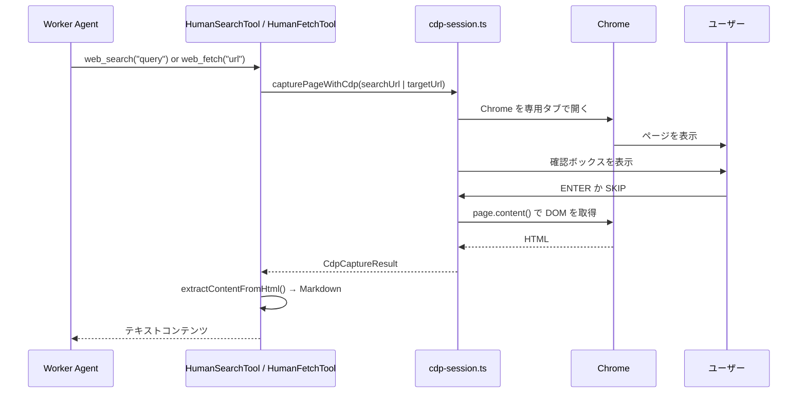

# Human Mode ガイド

## Human Mode とは

Human Mode は、エージェントがあなたの Chrome ブラウザを使って調査する仕組みです。ページを開く場所や調べる順番はエージェントが決めます。あなたはページを確認して、問題なければ ENTER を押すだけです。

この役割分担のおかげで、難しい調査でも人が毎回手作業で検索し直す必要がありません。エージェントが調査先を選び、あなたは「今見えているページで進めてよいか」を確認するだけで済みます。

Human Mode は、たとえば次のような場面で役立ちます。

- 社内ネットワークで外部検索サービスが使えないとき
- CAPTCHA が出て自動取得できないとき
- ログインが必要なページを調べたいとき

## はじめる前に確認すること

### Node.js の確認

まず Node.js が入っているか確認します。

```bash
node --version
```

期待される出力の例:

```text
v18.20.5
```

`v18` 以上が出れば十分です。

### Chrome の確認

Human Mode では Chrome を使います。インストールされているか確認してください。

Windows の例:

```powershell
Get-Command chrome
```

macOS の例:

```bash
ls "/Applications/Google Chrome.app/Contents/MacOS/Google Chrome"
```

Windows では通常 `C:\Program Files\Google\Chrome\Application\chrome.exe`、macOS では `/Applications/Google Chrome.app/Contents/MacOS/Google Chrome` にあります。

### セットアップ確認（npm run chrome-setup）

次のコマンドで、Chrome の起動確認と接続確認をまとめて行えます。

```bash
npm run chrome-setup
```

成功時の出力例:

```text
=== Human Mode セットアップ確認 ===

✓ Chrome: C:\Program Files\Google\Chrome\Application\chrome.exe
✓ プロファイルディレクトリ: ...
✓ CDP 接続 OK: ws://127.0.0.1:9222/...
✓ Human Mode の準備ができました。
```

失敗時の出力例:

```text
✗ Chrome が見つかりません: ...
  環境変数 CHROME_PATH に Chrome のパスを設定してください。
```

Chrome が見つからない場合は、後半のトラブルシューティングを参照してください。

## 実際の操作の流れ

### 1. エージェントを起動して調査を依頼する

まず通常どおりエージェントを起動し、自然な日本語で調査を依頼します。

### 2. 確認ボックスが表示されたら

調査先のページが開くと、ターミナルに次の確認ボックスが表示されます。

```text
╔══════════════════════════════════════════════════════════════════╗
║  【Human Mode】 あなたの操作が必要です                           ║
╠══════════════════════════════════════════════════════════════════╣
║  Chrome ブラウザで以下のページを自動で開いています:              ║
║  https://www.google.com/search?q=...                             ║
║                                                                  ║
║  ページが表示されたら、このターミナルに戻って                    ║
║                                                                  ║
║         >> ENTER キーを押してください <<                         ║
║                                                                  ║
║  ※ページをスキップする場合は "SKIP" と入力して ENTER            ║
╚══════════════════════════════════════════════════════════════════╝

>
```

### 3. ページを確認して ENTER を押す

ページが表示されたら、内容を確認して次のどれかを選びます。

- 普通のページなら、そのまま ENTER を押します
- ログインが必要なページなら、ログインしてから ENTER を押します
- CAPTCHA が出たページなら、解除してから ENTER を押します
- スキップしたいページなら、`SKIP` と入力して ENTER を押します

### 4. これを繰り返す

エージェントは必要なページを順番に開きます。あなたは毎回、表示されたページを見て ENTER を押すだけです。

### 5. 調査が完了したら

調査が終わると、`workspace/output/report.md` や関連ファイルが作られます。必要なら `workspace/task-plan.md` も確認してください。

## Ctrl+X で作業を中断・変更する

ENTER を待っている最中でも、**Ctrl+X** で割り込みダイアログを開けます。いまの調査を止めたい、方針を変えたい、マネージャーに質問したいときに使います。

| 選択肢 | いつ使うか |
|---|---|
| **Stop and exit loop** | 調査を完全に止めたいとき |
| **Modify task instructions** | 「もっと〇〇を重視して」と方針を変えたいとき |
| **Ask manager a question** | 「今どこまで進んでいる？」と確認したいとき（調査は止まらない） |
| **Resume** | 間違えて Ctrl+X を押したとき |

`Ask manager a question` を選ぶと、調査を止めずにマネージャーへ質問できます。

## 現在の進捗を確認する

調査の構造と進捗は `workspace/task-plan.md` に記録されます。別ターミナルで次のコマンドを実行すると、今どこまで進んでいるかを見られます。

```bash
cat workspace/task-plan.md
```

また、Ctrl+X → `Ask manager a question` → 「今どこまで進んでいる？」と聞く方法でも確認できます。

## よくある質問

### Chrome が 2 つ起動してしまった

手動で起動した Chrome と、エージェントが起動した Chrome の両方がある可能性があります。`npm run chrome-setup` を実行して、接続確認だけ先に済ませてください。

### 確認ボックスが出ない

ページの読み込み中や、まだ確認が必要なページに到達していない可能性があります。少し待っても出ない場合は、いったん停止して再実行してください。

### ページが真っ白で何も表示されない

読み込み直後でまだ内容が描画されていないことがあります。ページが完全に表示されるまで待ってから ENTER を押してください。

### ENTER を押したのに何も起きない

入力待ちではなく別のフェーズにいる可能性があります。確認ボックスが表示されている状態で Enter を押してください。

### タブがたくさん開いてしまった

Human Mode は専用タブを再利用します。通常は毎回新しいタブを増やしません。もし大量に開いた場合は、一度止めて再起動してください。

### ログインしたのにまたログイン画面が出る

別のセッションや別プロファイルで開いている可能性があります。Chrome を同じプロファイルで起動し直してから、もう一度試してください。

## トラブルシューティング

### Chrome に接続できない

```text
Error: connect ECONNREFUSED 127.0.0.1:9222
```

対処手順:

- `npm run chrome-setup` を実行して、起動と接続をまとめて確認します
- `CHROME_PATH` に Chrome の実行ファイルを設定します
- Chrome を手動で `--remote-debugging-port=9222` 付きで起動します

### `CHROME_PATH` を設定したい

Windows では PowerShell で次のように設定します。

```powershell
$env:CHROME_PATH = "C:\Program Files\Google\Chrome\Application\chrome.exe"
```

macOS では次のように設定します。

```bash
export CHROME_PATH="/Applications/Google Chrome.app/Contents/MacOS/Google Chrome"
```

### Chrome を手動で起動したい

Windows の例:

```powershell
"C:\Program Files\Google\Chrome\Application\chrome.exe" --remote-debugging-port=9222 --no-first-run --no-default-browser-check
```

macOS の例:

```bash
"/Applications/Google Chrome.app/Contents/MacOS/Google Chrome" --remote-debugging-port=9222 --no-first-run --no-default-browser-check
```

### ページが正しく取得されない

Enter を押した後に空またはほぼ空の内容が返る場合は、ページがまだ描画中かもしれません。完全に表示されてから Enter を押してください。

### ログインや CAPTCHA に時間がかかる

Human Mode では待ち時間のタイムアウトを気にしなくて大丈夫です。ログインや CAPTCHA の解除が終わってから Enter を押してください。

### 専用タブが閉じられた

専用タブが閉じられても、次の取得時に作り直されます。必要なら一度エージェントを止めて再開してください。

## 調査が終わったら

### 成果物を保存して次の調査へ

調査が終わったら、まず成果物を保存します。

```bash
npm run archive
```

名前はエージェントが自動で提案してくれます。Y を押すだけで保存できます。保存が終わったら、ワークスペースをリセットして次の調査を始めます。

```bash
npm run new-project
npm start
```

### 過去の調査を一覧で確認したいとき

```bash
npm run list-archives
```

日時・調査名・品質スコアが一覧で表示されます。

### 過去の調査の続きをしたいとき

コマンドは不要です。`npm start` で起動して、次のように依頼するだけです。

```text
「〇〇の調査」の続きで、△△の部分を追加調査してください
```

エージェントが自動でアーカイブを探して調査を再開します。

## 設定のカスタマイズ（上級者向け）

| 変数名 | デフォルト | 使いどころ |
|---|---|---|
| `SEARCH_MODE` | `human` | 自動検索モードを使いたいときだけ `auto` にします |
| `HUMAN_SEARCH_ENGINE` | `https://www.google.com/search?q=` | Google 以外の検索エンジンを使いたいときに変更します。例: `https://duckduckgo.com/?q=` |
| `CHROME_WINDOW_POSITION` | （なし） | Chrome を特定のモニターに置きたいときに使います。例: `0,0` |
| `CHROME_WINDOW_SIZE` | （なし） | Chrome の大きさを固定したいときに使います。例: `1280,900` |

`CHROME_WINDOW_POSITION` と `CHROME_WINDOW_SIZE` は、マルチモニター環境で見やすい位置に Chrome を出したいときに便利です。

## 仕組みの詳細（開発者向け）

このセクションは開発者向けです。

Human Mode では、`web_search` と `web_fetch` が Chrome 上の専用タブを使ってページを開き、確認後に HTML を取得します。取得した内容は Markdown に変換され、Worker に渡されます。



関連する実装の要点:

- `capturePageWithCdp()` が確認待ちと DOM 取得を担当します
- `waitForUserEnter()` は `AbortSignal` に対応していて、Ctrl+X の割り込みに反応します
- `closeDedicatedTab()` により、専用タブは終了時に整理されます
- Human Mode と auto モードの切り替えは `loadSearchConfig()` の `SEARCH_MODE` で決まります

### 参考となる実際の表示

`capturePageWithCdp()` が出す確認ボックスは次の形式です。

```text
╔══════════════════════════════════════════════════════════════════╗
║  【Human Mode】 あなたの操作が必要です                           ║
╠══════════════════════════════════════════════════════════════════╣
║  Chrome ブラウザで以下のページを自動で開いています:              ║
║  https://www.google.com/search?q=...                             ║
║                                                                  ║
║  ページが表示されたら、このターミナルに戻って                    ║
║                                                                  ║
║         >> ENTER キーを押してください <<                         ║
║                                                                  ║
║  ※ページをスキップする場合は "SKIP" と入力して ENTER            ║
╚══════════════════════════════════════════════════════════════════╝
```
