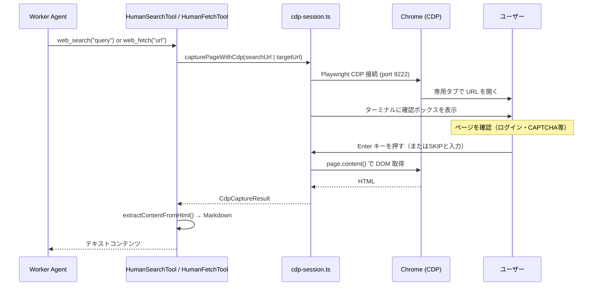

# Human Mode ガイド（SEARCH_MODE=human）

Human Mode は、エージェントのWeb取得処理を自動ヘッドレスブラウザではなく、ユーザーが操作する実際のChrome ブラウザ経由で行うモードです。JavaScriptレンダリング・CAPTCHA・ログイン壁など、ヘッドレスブラウザでアクセスできないページの取得に使用します。

## 仕組み



## セットアップ

### 前提条件

Chrome（または Chromium）がインストールされていること。CDP リモートデバッグを有効にして起動する必要があります。

| OS | 推奨インストール先 |
|---|---|
| Windows | `C:\Program Files\Google\Chrome\Application\chrome.exe` |
| macOS | `/Applications/Google Chrome.app/Contents/MacOS/Google Chrome` |
| Linux | `/usr/bin/google-chrome` または `/usr/bin/chromium-browser` |

### Chrome の起動

`ensureChromeReady()` が Chrome の未起動を検出した場合、自動でプロセスを起動します。手動で起動する場合は以下のオプションが必要です。

```bash
# Windows (例)
chrome.exe --remote-debugging-port=9222 --no-first-run --no-default-browser-check

# macOS
/Applications/Google\ Chrome.app/Contents/MacOS/Google\ Chrome \
  --remote-debugging-port=9222 --no-first-run --no-default-browser-check
```

### セットアップ確認

以下のコマンドで Chrome の検出・起動・CDP 接続をまとめて確認できます。

```bash
npm run chrome-setup
```

成功すると以下のように表示されます:

```
=== Human Mode セットアップ確認 ===

✓ Chrome: C:\Program Files\Google\Chrome\Application\chrome.exe
✓ プロファイルディレクトリ: C:\Users\...\AppData\Local\Temp\pi-agent-chrome-profile

CDP ポート 9222 への接続を確認しています...
✓ CDP 接続 OK: ws://127.0.0.1:9222/devtools/browser/...

✓ Human Mode の準備ができました。
```

Chrome が見つからない場合は `CHROME_PATH` 環境変数でパスを指定してください。

### 有効化

`.env` ファイルに以下を追加します。

```bash
SEARCH_MODE=human
```

## 環境変数

| 変数名 | デフォルト | 説明 |
|---|---|---|
| `SEARCH_MODE` | `auto` | `human` に設定するとHuman Modeが有効になる |
| `HUMAN_SEARCH_ENGINE` | `https://www.google.com/search?q=` | 検索に使用する公開検索エンジン（例: `https://duckduckgo.com/?q=`） |
| `CHROME_WINDOW_POSITION` | （なし） | Chrome ウィンドウの初期位置 `X,Y`（例: `0,0`） |
| `CHROME_WINDOW_SIZE` | （なし） | Chrome ウィンドウの初期サイズ `W,H`（例: `1280,900`） |

`CHROME_WINDOW_POSITION` と `CHROME_WINDOW_SIZE` はマルチモニター環境でウィンドウを特定の画面に配置したい場合に有効です。

## 操作フロー

エージェントが `web_search` または `web_fetch` を呼び出すと、Chrome の専用タブ (`pi-agent-dedicated`) でURLが開きます。ターミナルに以下のような確認ボックスが表示されます。

```
╔══════════════════════════════════════════════════════════════════╗
║  【Human Mode】 あなたの操作が必要です                           ║
╠══════════════════════════════════════════════════════════════════╣
║  Chrome ブラウザで以下のページを自動で開いています:              ║
║  https://www.google.com/search?q=...                             ║
║                                                                  ║
║  ページが表示されたら、このターミナルに戻って                    ║
║                                                                  ║
║         >> ENTER キーを押してください <<                         ║
║                                                                  ║
║  ※ページをスキップする場合は "SKIP" と入力して ENTER            ║
╚══════════════════════════════════════════════════════════════════╝

>
```

ページを確認し、必要であればログインや CAPTCHA 解除などの操作を行った後、以下のいずれかの操作をします。

| 操作 | 動作 |
|---|---|
| **Enter キーを押す** | 現在のページのDOMを取得し、Markdown に変換してエージェントに返す |
| `SKIP` と入力して Enter | このURLをスキップし、エージェントにスキップを通知する |

### SKIP の動作

- 同一URLへの再取得は最大2回まで試行される
- 2回ともSKIPまたはエラーの場合、エージェントはそのURLを引用しない
- 応答待ちにタイムアウトはない（ページ読み込みのタイムアウトは15秒で、超過した場合は現在のDOMをそのまま取得する）

## 備考

| 項目 | 内容 |
|---|---|
| 専用タブ | タブタイトルが `pi-agent-dedicated` のタブを再利用する。毎回新規タブは作成されない |
| Chrome 再起動 | Chrome を再起動した場合、次のツール呼び出し時に自動で再接続される |
| 他のタブへの影響 | 専用タブのみ操作する。他のタブは影響を受けない |
| SearXNG との関係 | Human Mode 時は SearXNG を使用しない。公開検索エンジン（デフォルト: Google）をブラウザで直接開く |
| プロファイル場所 | `getUserDataDir()` が返すパス（OS別の一時ディレクトリ）を使用 |

## auto モードとの比較

| 比較項目 | `auto`（デフォルト） | `human` |
|---|---|---|
| ブラウザ操作 | Playwrightヘッドレス自動実行 | ユーザーが操作 |
| CAPTCHA対応 | 不可 | 可（手動突破） |
| ログイン壁対応 | 不可 | 可（手動ログイン） |
| 速度 | 高速（自動） | ユーザー操作待ち |
| Chrome起動要否 | 不要 | 必要（CDP ポート 9222） |
| SearXNG 依存 | あり | なし（公開検索エンジンをブラウザで直接開く） |
| 人間の介在 | なし | 各URL取得ごとに確認が必要 |

## トラブルシューティング

### Chrome に接続できない

```
Error: connect ECONNREFUSED 127.0.0.1:9222
```

Chrome が CDP デバッグポート 9222 で起動していないか、ファイアウォールでブロックされています。`ensureChromeReady()` が自動起動を試みますが、失敗した場合は手動で Chrome を CDP オプション付きで起動してください。

### ページが正しく取得されない

Enter を押した後に空またはほぼ空のコンテンツが返される場合、ページが JavaScript で遅延レンダリングされている可能性があります。ページが完全に表示されるまで待ってから Enter を押してください。

### ログイン・CAPTCHA 操作に時間がかかる

確認プロンプトの応答待ちにタイムアウトはないため、ログインや CAPTCHA 解除に時間をかけても問題ありません。操作が完了したら Enter を押してください。

### 専用タブが閉じられた

`pi-agent-dedicated` タブが誤って閉じられた場合、次のツール呼び出し時に自動的に新しいタブが作成されます。
